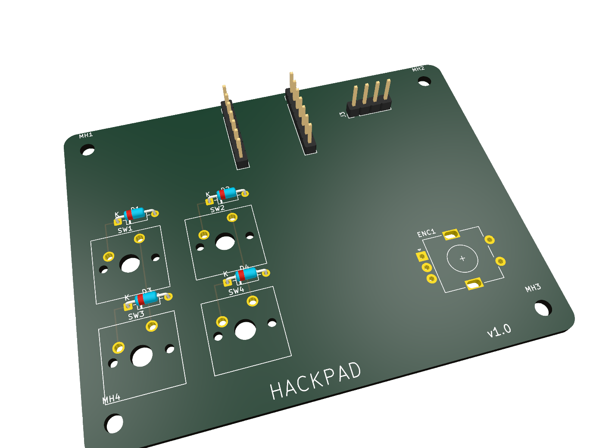
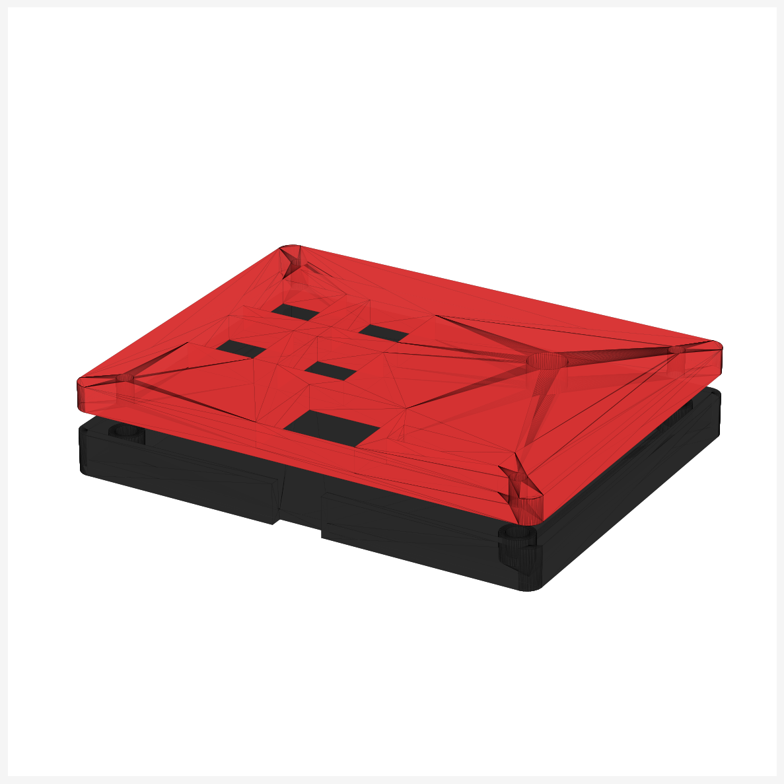
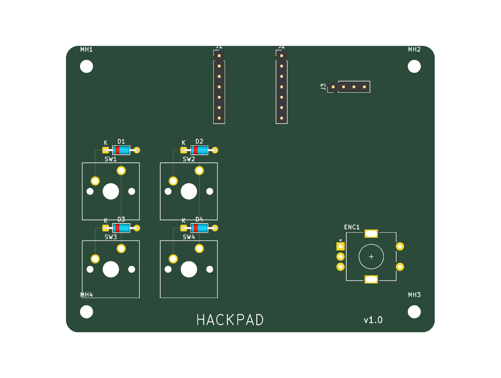
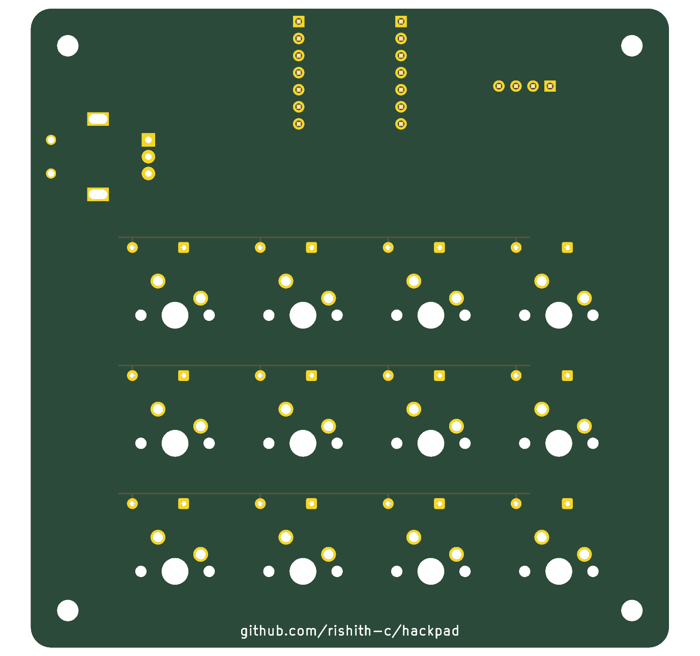

# Hackpad

A 4-key macropad with a rotary encoder and an OLED display, built on a Seeed
XIAO RP2040 and running KMK firmware. Submitted to Hack Club's
[Hackpad](https://hackpad.hackclub.com) You Ship, We Ship program.

It's a "complete" macropad in the smallest reasonable size — every kind of
input the Hackpad kit ships (MX switch, rotary encoder, OLED display) is on
the board, and it fits cleanly inside the 100 × 100 mm PCB rule with a
2-part 3D-printed case.



## Features

- **4 MX mechanical switches** in a 2 × 2 diode matrix (COL2ROW, 1N4148)
- **1 EC11 rotary encoder** with push-switch — defaults to volume / mute
- **0.91" 128 × 32 SSD1306 OLED** showing the active layer
- **2 firmware layers** (shortcuts / media), momentary switching via the
  bottom-right key
- **Two-part 3D-printed case** (red top plate + black bottom tray), M3
  heatset insert bosses, USB-C side cutout
- **Optional SK6812 RGB underglow** off XIAO D10 (hand-wired, not on PCB)

## CAD model

Full assembled view is in [`cad/assembled-model.step`](cad/assembled-model.step) —
GitHub will render the STEP inline. Two 3D-printed parts make up the case:



- **[Top plate](production/Top.stl)** (5 mm thick): MX switch cutouts
  (14 × 14 mm), encoder shaft hole, OLED window, XIAO inspection window,
  4× M3 screw clearance holes.
- **[Bottom tray](production/Bottom.stl)** (8 mm thick): PCB rest ledge,
  4× M3 heatset insert bosses, USB-C cutout in the side wall.

Case fits within **94 × 74 × 15 mm** — comfortably under Hackpad's
200 × 200 × 100 mm limit. Screwed together with 4× M3 × 16 mm SHCS bolts
into M3 × 5 × 4 mm brass heatset inserts.

## PCB

Built in [KiCad 9](https://www.kicad.org/) from
[`pcb/hackpad.kicad_pro`](pcb/hackpad.kicad_pro). The whole board is
generated programmatically by [`build_scripts/build_pcb.py`](build_scripts/build_pcb.py)
from the netlist + placement CSVs — re-running it reproduces the
`.kicad_pcb` byte-for-byte.

Schematic:


PCB layout (top and bottom copper):




- **Dimensions:** 90 × 70 mm (within the Hackpad 100 × 100 mm rule)
- **Layers:** 2 (F.Cu signal trunks + B.Cu GND pour and ROW trunks)
- **Pin order on OLED header:** GND – VCC – SCL – SDA (kit spec)
- **Footprints:** Cherry MX 1.00u PCB, 1N4148 DO-35 horizontal,
  EC11E-Switch, XIAO on 2 × `PinHeader_1x07_P2.54mm_Vertical`, OLED on
  `PinHeader_1x04_P2.54mm_Vertical`, `MountingHole_3.2mm_M3`
- **Routing:** the matrix is fully routed in copper (COL trunks on F.Cu,
  ROW trunks on B.Cu with cathode tabs, switch → anode bridges, GND pour).
  11 short XIAO ↔ peripheral signal pulls (COL × 4, ROW × 4, SDA, SCL,
  5V, ENC_A/B/PUSH, RGB DIN) are left as ratlines for ~5 min of
  interactive routing — see [`pcb/HOW_TO_FINISH.md`](pcb/HOW_TO_FINISH.md)
  for the exact start/end coordinates of each pull.
- **DRC:** passes at error level
  (`kicad-cli pcb drc --severity-error` → **0 violations**)

Gerbers exported and ready for JLCPCB:
[`production/gerbers.zip`](production/gerbers.zip).
Order at 2 layers · 1.6 mm · HASL · green.

## Firmware

KMK (CircuitPython). See [`firmware/README.md`](firmware/README.md) for
flashing instructions. Sources in [`firmware/KMK/`](firmware/KMK/):

| File | Purpose |
|---|---|
| [`firmware/KMK/main.py`](firmware/KMK/main.py) | matrix + encoder + OLED setup, 2 keymap layers |
| [`firmware/KMK/code.py`](firmware/KMK/code.py) | CircuitPython entry point (imports `main`) |
| [`firmware/KMK/boot.py`](firmware/KMK/boot.py) | disables CIRCUITPY auto-reload while plugged in |

Default keymap:

| Layer | Top-L | Top-R | Bot-L | Bot-R | Encoder turn | Encoder push |
|---|---|---|---|---|---|---|
| 0 (default) | A | B | C | hold for layer 1 | volume +/− | mute |
| 1 (media) | mute | play/pause | prev track | (hold) | next/prev track | play/pause |

## Pin map

The XIAO RP2040 exposes 11 usable GPIO. This design uses 10:

| XIAO | GPIO | Role |
|---|---|---|
| D0 | GP26 | matrix COL0 (left column) |
| D1 | GP27 | matrix COL1 (right column) |
| D2 | GP28 | encoder phase A |
| D3 | GP29 | encoder phase B |
| D4 | GP6 | OLED SDA (I²C1) |
| D5 | GP7 | OLED SCL (I²C1) |
| D6 | GP0 | matrix ROW0 (top row) |
| D7 | GP1 | matrix ROW1 (bottom row) |
| D8 | GP2 | encoder push-switch |
| D10 | GP3 | SK6812 RGB data (off-board, optional) |

D9 (GP4) is left spare — wire up a second encoder, an external LED, or a
5th switch in firmware later if you want. See
[`pcb/DESIGN_NOTES.md`](pcb/DESIGN_NOTES.md).

## Bill of Materials

See [`production/BOM.csv`](production/BOM.csv). Everything is in the
Hackpad kit.

- 1 × Seeed XIAO RP2040 (through-hole, mounts on 2 × 1×7 pin sockets)
- 4 × Cherry MX mechanical switch (uses 4 / 16 from the kit)
- 4 × DSA blank keycap (uses 4 / 16 from the kit)
- 4 × 1N4148 diode, DO-35 (uses 4 / 20 from the kit)
- 1 × EC11 rotary encoder with push-switch (uses 1 / 2 from the kit)
- 1 × 0.91" SSD1306 128×32 OLED (I²C, addr 0x3C, pin order GND-VCC-SCL-SDA)
- 4 × M3 × 16 mm SHCS bolt (uses 4 / 6 from the kit)
- 4 × M3 × 5 × 4 mm brass heatset insert (uses 4 / 6 from the kit)
- 1 × 3D-printed top plate ([`production/Top.stl`](production/Top.stl))
- 1 × 3D-printed bottom tray ([`production/Bottom.stl`](production/Bottom.stl))
- (Optional) up to 2 × SK6812 MINI-E LEDs for underglow, hand-wired off D10

## Repository layout

```
├── README.md
├── LICENSE
├── cad/
│   └── assembled-model.step              # full assembled CAD (Hackpad spec: STEP/STP/3MF)
├── pcb/
│   ├── hackpad.kicad_pro                 # KiCad project
│   ├── hackpad.kicad_sch                 # schematic (text annotation; canonical viz in assets/schematic.png)
│   ├── hackpad.kicad_pcb                 # placed + matrix-routed board
│   ├── netlist.csv                       # canonical net list
│   ├── placement.csv                     # per-part X/Y/rotation
│   ├── DESIGN_NOTES.md                   # build variants / encoder swaps / RGB notes
│   └── HOW_TO_FINISH.md                  # 5-min interactive routing checklist
├── firmware/
│   ├── README.md
│   └── KMK/
│       ├── main.py                       # KMK firmware (matrix + encoder + OLED)
│       ├── code.py                       # CircuitPython entry point
│       └── boot.py                       # boot-time config
├── production/
│   ├── gerbers.zip                       # for JLCPCB (2 layers, 1.6 mm)
│   ├── Top.step / Top.stl                # top plate
│   ├── Bottom.step / Bottom.stl          # bottom tray
│   ├── main.py                           # KMK production firmware (copy of firmware/KMK/main.py)
│   ├── BOM.csv                           # bill of materials
│   └── HOW_TO_FINISH.md                  # finish-the-routing checklist
├── assets/                               # README screenshots (PCB top/bottom/iso, case iso, schematic png/svg/pdf)
└── build_scripts/
    ├── build_pcb.py                      # regenerates pcb/hackpad.kicad_pcb via pcbnew
    ├── build_case.py                     # regenerates production STLs + cad/assembled-model.step via cadquery
    └── build_schematic.py                # regenerates assets/schematic.{svg,png} via schemdraw
```

## Submitting to Hackpad

This repo matches the [Hackpad submission requirements](https://hackpad.hackclub.com/submitting):

- PCB ≤ 100 × 100 mm ✅ (this board is 90 × 70 mm)
- < 16 inputs ✅ (5: 4 keys + 1 encoder)
- 2-layer PCB ✅
- Through-hole XIAO RP2040 ✅
- All-3D-printed case ✅
- Folder layout: `cad/`, `pcb/`, `firmware/`, `production/`, `README.md` ✅
  (matches the [Orpheuspad reference](https://github.com/hackclub/hackpad/tree/main/hackpads/orpheuspad))

Submission steps:

1. **Post a ship** in `#hackpad-ships` on the Hack Club Slack (link to this repo + photos from `assets/`).
2. **Fill out the submission form**: <https://forms.hackclub.com/hackpad-submission>.
3. Reviewed by `@alexren`. On approval you receive the kit + a $15 grant
   for JLCPCB PCB fab + a free 3D-printed case from another Hack Clubber.

## Regenerating from source

```bash
# PCB (uses KiCad 9 bundled Python — pcbnew API)
/Applications/KiCad.app/Contents/Frameworks/Python.framework/Versions/Current/bin/python3 build_scripts/build_pcb.py

# Case (pip install cadquery)
python3 build_scripts/build_case.py

# Schematic (pip install schemdraw cairosvg; cairo from Homebrew)
python3 build_scripts/build_schematic.py

# Gerbers + drill files, bundled to production/gerbers.zip
mkdir -p /tmp/gerbers && \
  /Applications/KiCad.app/Contents/MacOS/kicad-cli pcb export gerbers \
    --output /tmp/gerbers/ \
    --layers "F.Cu,B.Cu,F.Silkscreen,B.Silkscreen,F.Mask,B.Mask,Edge.Cuts" \
    pcb/hackpad.kicad_pcb && \
  /Applications/KiCad.app/Contents/MacOS/kicad-cli pcb export drill \
    --output /tmp/gerbers/ --excellon-separate-th pcb/hackpad.kicad_pcb && \
  ( cd /tmp/gerbers && zip /path/to/production/gerbers.zip *.gtl *.gbl *.gto *.gbo *.gts *.gbs *.gm1 *.drl )
```

## License

[MIT](LICENSE).
