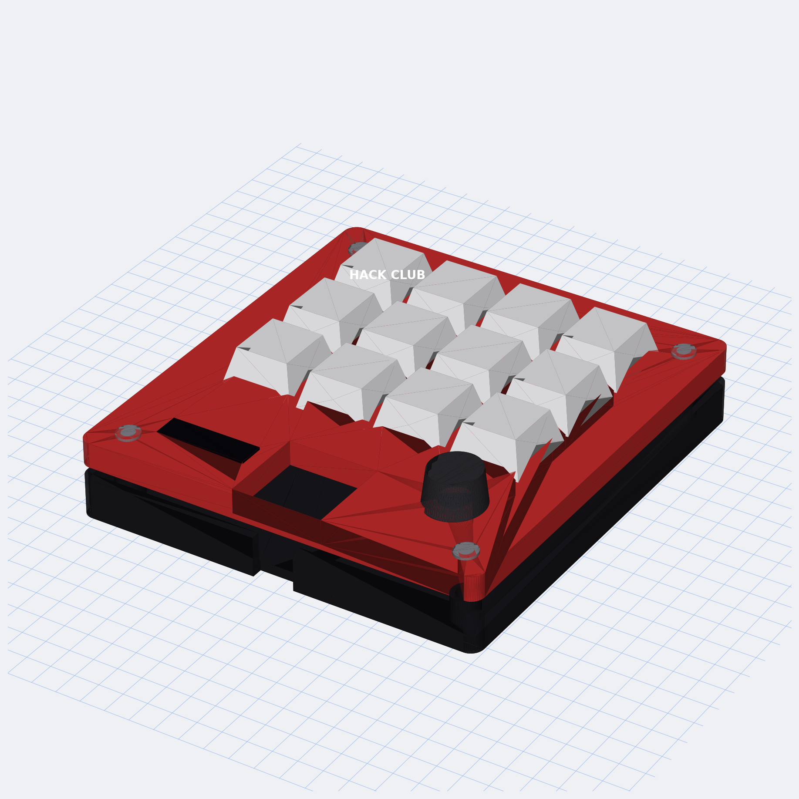

# Hackpad

A 12-key macropad with a rotary encoder and an OLED display, built on a
Seeed XIAO RP2040 and running KMK firmware. Submitted to Hack Club's
[Hackpad](https://hackpad.hackclub.com) You Ship, We Ship program.

**v2** — the most loaded build that fits the Hackpad rules at once:
12 MX keys, 1 EC11 rotary encoder, 1 OLED display, and every usable GPIO
on the XIAO consumed (11 / 11). 13 inputs, well under the 16-input cap;
95 × 95 mm board, well inside the 100 × 100 mm size cap.



## Features

- **12 MX mechanical switches** in a 4 × 3 diode matrix (COL2ROW, 1N4148)
- **1 EC11 rotary encoder** — defaults to volume +/− (re-mapped per layer)
- **0.91" 128 × 32 SSD1306 OLED** showing the active layer name
- **3 firmware layers** (default / media / numpad), momentary switching
  via the bottom-right key (and bottom-right-2 for L2)
- **Two-part 3D-printed case** (red top plate + black bottom tray),
  M3 heatset insert bosses, USB-C side cutout
- **Individual STL part files** for every printable AND hardware item
  (top, bottom, M3 screws, heatset inserts)

## CAD model

Full assembled view in [`cad/assembled-model.step`](cad/assembled-model.step) —
GitHub renders the STEP inline. STL version in
[`cad/assembled-model.stl`](cad/assembled-model.stl).

Printable + hardware parts (all generated by
[`build_scripts/build_case.py`](build_scripts/build_case.py)):

| Part | STL | STEP | Notes |
|---|---|---|---|
| Top plate (red, 5 mm) | [Top.stl](production/Top.stl) | [Top.step](production/Top.step) | 12 MX cutouts + encoder hole + OLED window + XIAO inspection |
| Bottom tray (black, 8 mm) | [Bottom.stl](production/Bottom.stl) | [Bottom.step](production/Bottom.step) | 4× heatset bosses + USB-C side cutout |
| M3 × 16 mm SHCS screw (×4) | [M3x16_Screw.stl](production/M3x16_Screw.stl) | [M3x16_Screw.step](production/M3x16_Screw.step) | hardware visualization — kit supplies real ones |
| M3 × 5 × 4 mm brass heatset insert (×4) | [HeatsetInsert_M3x5x4.stl](production/HeatsetInsert_M3x5x4.stl) | [HeatsetInsert_M3x5x4.step](production/HeatsetInsert_M3x5x4.step) | hardware visualization — kit supplies real ones |

Case fits within **99 × 99 × 15 mm** — well inside Hackpad's
200 × 200 × 100 mm limit. Screwed together with 4 × M3 × 16 mm SHCS bolts
into M3 × 5 × 4 mm brass heatset inserts.

## PCB

Built in [KiCad 9](https://www.kicad.org/) from
[`pcb/hackpad.kicad_pro`](pcb/hackpad.kicad_pro). The whole board is
generated programmatically by
[`build_scripts/build_pcb.py`](build_scripts/build_pcb.py) from the netlist
+ placement CSVs — re-running it reproduces the `.kicad_pcb` byte-for-byte.

Schematic:


PCB layout (top and bottom copper):


- **Dimensions:** 95 × 95 mm (within the Hackpad 100 × 100 mm rule)
- **Layers:** 2 (F.Cu signal trunks + B.Cu GND pour and ROW trunks)
- **OLED header pin order:** GND – VCC – SCL – SDA (kit spec)
- **Footprints:** Cherry MX 1.00u PCB, 1N4148 DO-35 horizontal,
  EC11E vertical, XIAO on 2 × `PinHeader_1x07_P2.54mm_Vertical`,
  OLED on `PinHeader_1x04_P2.54mm_Vertical`, `MountingHole_3.2mm_M3`
- **Routing:** matrix is fully routed in copper (4 COL trunks F.Cu,
  3 ROW trunks B.Cu with cathode tabs, 12 switch→anode bridges, GND
  pour). 11 short XIAO ↔ peripheral signal pulls (4 COL + 3 ROW + SDA
  + SCL + 5V + ENC_A + ENC_B) are left as ratlines for ~5 min of
  interactive routing — see
  [`pcb/HOW_TO_FINISH.md`](pcb/HOW_TO_FINISH.md) for the exact
  start/end coordinates of each pull.
- **Silkscreen:** `HACKPAD v2.0` on the front, `github.com/rishith-c/hackpad`
  on the back.
- **DRC:** passes at error level
  (`kicad-cli pcb drc --severity-error` → **0 violations**)

Gerbers exported and ready for JLCPCB:
[`production/gerbers.zip`](production/gerbers.zip).
Order at 2 layers · 1.6 mm · HASL · green.

## Firmware

KMK (CircuitPython). See [`firmware/README.md`](firmware/README.md) for
flashing instructions. Sources in [`firmware/KMK/`](firmware/KMK/):

| File | Purpose |
|---|---|
| [`firmware/KMK/main.py`](firmware/KMK/main.py) | 4×3 matrix + encoder + OLED setup, 3 keymap layers |
| [`firmware/KMK/code.py`](firmware/KMK/code.py) | CircuitPython entry point (imports `main`) |
| [`firmware/KMK/boot.py`](firmware/KMK/boot.py) | disables CIRCUITPY auto-reload while plugged in |

## Pin map

The XIAO RP2040 exposes 11 usable GPIO. **All 11 are used.**

| XIAO | GPIO | Role |
|---|---|---|
| D0 | GP26 | matrix COL0 (left column) |
| D1 | GP27 | matrix COL1 |
| D2 | GP28 | matrix COL2 |
| D3 | GP29 | matrix COL3 (right column) |
| D4 | GP6 | OLED SDA (I²C1) |
| D5 | GP7 | OLED SCL (I²C1) |
| D6 | GP0 | matrix ROW0 (top row) |
| D7 | GP1 | matrix ROW1 (middle row) |
| D8 | GP2 | matrix ROW2 (bottom row) |
| D9 | GP4 | encoder phase A |
| D10 | GP3 | encoder phase B |

No spare GPIOs. See [`pcb/DESIGN_NOTES.md`](pcb/DESIGN_NOTES.md) for
alternate firmware tweaks (drop OLED for encoder push + RGB; shrink
matrix to 3×3 for a second encoder; etc.) — each one reuses this same
PCB without changes.

## Bill of Materials

See [`production/BOM.csv`](production/BOM.csv). Everything except the
PLA filament is in the Hackpad kit.

- 1 × Seeed XIAO RP2040 (through-hole, mounts on 2 × 1×7 pin sockets)
- 12 × Cherry MX mechanical switch
- 12 × DSA blank keycap
- 12 × 1N4148 diode (DO-35)
- 1 × EC11 rotary encoder (A/B wired, push left unwired)
- 1 × 0.91" SSD1306 128 × 32 OLED (I²C, addr 0x3C, pin order GND-VCC-SCL-SDA)
- 4 × M3 × 16 mm SHCS bolt
- 4 × M3 × 5 × 4 mm brass heatset insert
- 1 × 3D-printed top plate ([`production/Top.stl`](production/Top.stl))
- 1 × 3D-printed bottom tray ([`production/Bottom.stl`](production/Bottom.stl))

## Repository layout

```
├── README.md
├── LICENSE
├── cad/
│   ├── assembled-model.step              # full assembly (Hackpad spec)
│   └── assembled-model.stl               # same, STL (GitHub interactive viewer)
├── pcb/
│   ├── hackpad.kicad_pro                 # KiCad project
│   ├── hackpad.kicad_sch                 # schematic stub (canonical viz in assets/schematic.png)
│   ├── hackpad.kicad_pcb                 # placed + matrix-routed board
│   ├── netlist.csv                       # canonical net list
│   ├── placement.csv                     # per-part X/Y/rotation
│   ├── DESIGN_NOTES.md                   # build variants / pin budget reasoning
│   └── HOW_TO_FINISH.md                  # 5-min interactive routing checklist
├── firmware/
│   ├── README.md
│   └── KMK/
│       ├── main.py                       # KMK firmware (matrix + encoder + OLED, 3 layers)
│       ├── code.py                       # CircuitPython entry point
│       └── boot.py                       # boot-time config
├── production/
│   ├── gerbers.zip                       # for JLCPCB (2 layers, 1.6 mm)
│   ├── Top.step / Top.stl                # top plate
│   ├── Bottom.step / Bottom.stl          # bottom tray
│   ├── M3x16_Screw.step / .stl           # individual screw model (used x4)
│   ├── HeatsetInsert_M3x5x4.step / .stl  # individual insert model (used x4)
│   ├── main.py                           # KMK production firmware (copy of firmware/KMK/main.py)
│   ├── BOM.csv                           # bill of materials
│   └── HOW_TO_FINISH.md                  # finish-the-routing checklist
├── assets/                               # README screenshots (PCB top/bottom/iso, mockup, schematic)
└── build_scripts/
    ├── build_pcb.py                      # regenerates pcb/hackpad.kicad_pcb via pcbnew
    ├── build_case.py                     # regenerates production STLs + cad/assembled-model via cadquery
    ├── build_schematic.py                # regenerates assets/schematic.{svg,png} via schemdraw
    └── build_mockup.py                   # regenerates assets/mockup.png (and ~/Desktop/) via matplotlib
```

## Submitting to Hackpad

This repo matches the [Hackpad submission requirements](https://hackpad.hackclub.com/submitting):

- PCB ≤ 100 × 100 mm ✅ (this board is 95 × 95 mm)
- < 16 inputs ✅ (13: 12 keys + 1 encoder)
- 2-layer PCB ✅
- Through-hole XIAO RP2040 ✅
- All-3D-printed case ✅
- Folder layout: `cad/`, `pcb/`, `firmware/`, `production/`, `README.md` ✅
  (matches the [Orpheuspad reference](https://github.com/hackclub/hackpad/tree/main/hackpads/orpheuspad))

Submission steps:

1. **Post a ship** in `#hackpad-ships` on the Hack Club Slack (link to
   this repo + photos from `assets/`).
2. **Fill out the submission form**: <https://forms.hackclub.com/hackpad-submission>.
3. Reviewed by `@alexren`. On approval you receive the kit + a $15
   grant for JLCPCB PCB fab + a free 3D-printed case from another
   Hack Clubber, plus optionally $18 for a soldering iron.

## Regenerating from source

```bash
# PCB (uses KiCad 9 bundled Python — pcbnew API)
/Applications/KiCad.app/Contents/Frameworks/Python.framework/Versions/Current/bin/python3 build_scripts/build_pcb.py

# Case + screws + assembled model (pip install cadquery)
python3 build_scripts/build_case.py

# Schematic (pip install schemdraw cairosvg; cairo from Homebrew)
DYLD_FALLBACK_LIBRARY_PATH=/opt/homebrew/lib python3 build_scripts/build_schematic.py

# Mockup PNG (pip install cadquery trimesh matplotlib)
python3 build_scripts/build_mockup.py

# Gerbers + drill files, bundled to production/gerbers.zip
mkdir -p /tmp/gerbers && \
  /Applications/KiCad.app/Contents/MacOS/kicad-cli pcb export gerbers \
    --output /tmp/gerbers/ \
    --layers "F.Cu,B.Cu,F.Silkscreen,B.Silkscreen,F.Mask,B.Mask,Edge.Cuts" \
    pcb/hackpad.kicad_pcb && \
  /Applications/KiCad.app/Contents/MacOS/kicad-cli pcb export drill \
    --output /tmp/gerbers/ --excellon-separate-th pcb/hackpad.kicad_pcb && \
  ( cd /tmp/gerbers && zip /path/to/production/gerbers.zip *.gtl *.gbl *.gto *.gbo *.gts *.gbs *.gm1 *.drl )
```

## License

[MIT](LICENSE).
